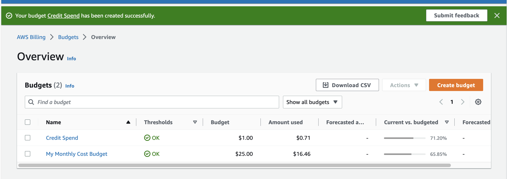
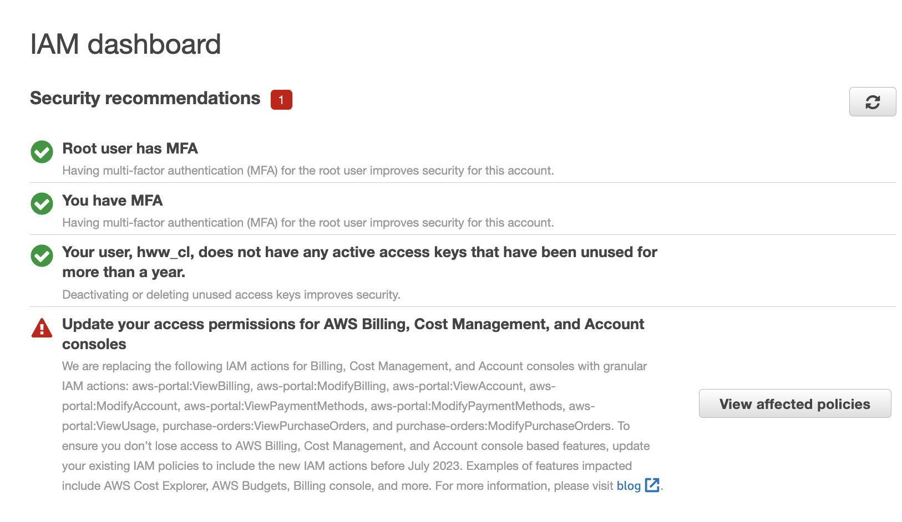
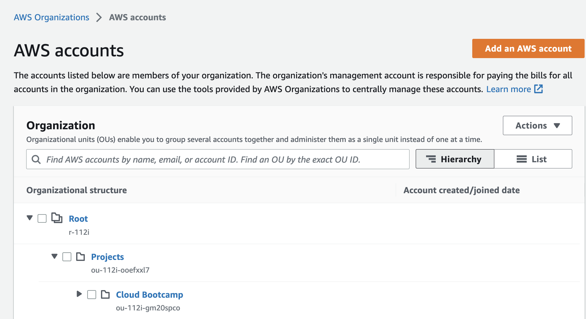
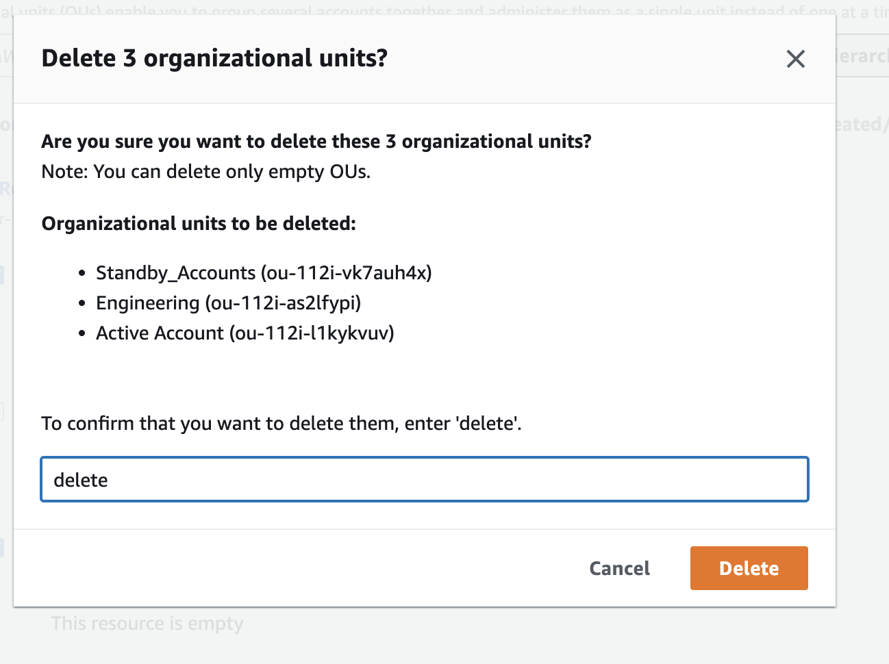
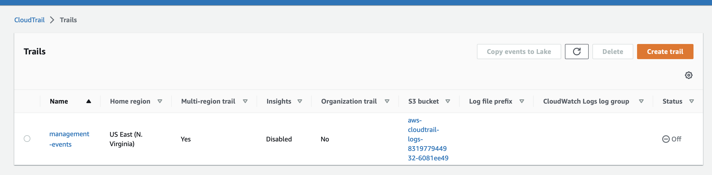
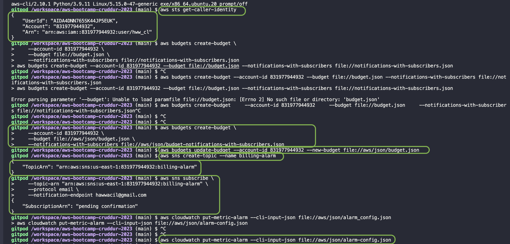
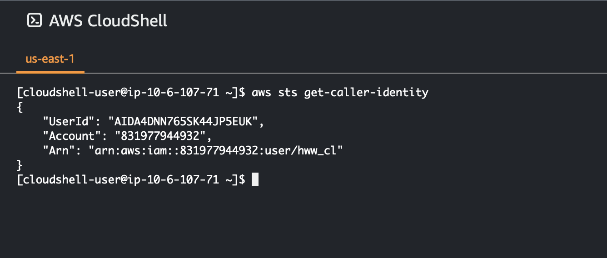
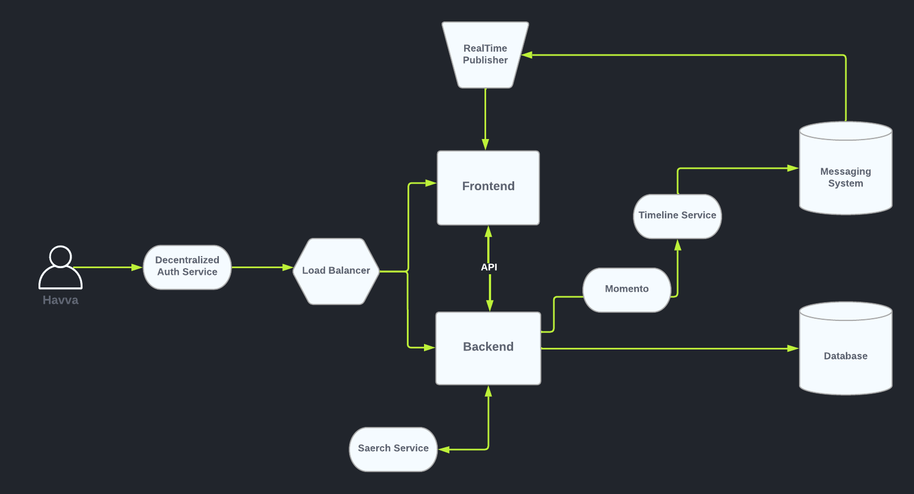
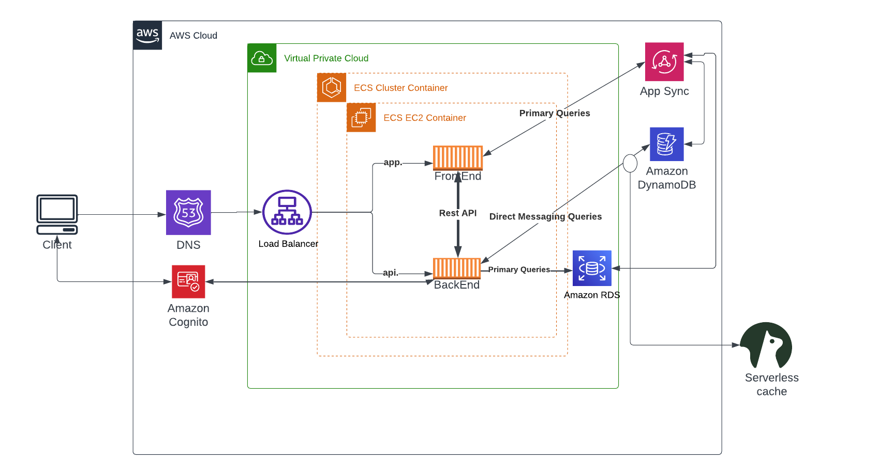

# Week 0 — Billing and Architecture

* [Prerequisites for this week](#prerequisites-for-this-week)
* [Required Homework](#required-homework)

## Prerequisites for this week
1. Created AWS Account
2. Created Lucid.io account
3. Cloned personal repo from [the template](https://github.com/ExamProCo/aws-bootcamp-cruddur-2023)  in ExamProCo
4. Joined to [the team's repo](https://github.com/MightyButLittle/aws-bootcamp-cruddur-2023) as a collaborator

## Required Homework

* Watched [the live stream](https://www.youtube.com/watch?v=SG8blanhAOg&list=PLBfufR7vyJJ7k25byhRXJldB5AiwgNnWv&index=12)
  * Read about ORM tools and iron triangle model
  * Read about [C4 model](https://c4model.com)
* Watched Chirag's [Week 0 - Spend Considerations](https://www.youtube.com/watch?v=OVw3RrlP-sI&list=PLBfufR7vyJJ7k25byhRXJldB5AiwgNnWv&index=13)
  * Created budgets with Chirag  
* Watched Ashish's [Week 0 - Security Considerations](https://www.youtube.com/watch?v=4EMWBYVggQI&list=PLBfufR7vyJJ7k25byhRXJldB5AiwgNnWv&index=15)
  * Set up MFA for root user, created IAM user 
  * Createdan AWS Organization and deleted for practice purposes
   *  
   * 
  * Enabling CloudTrail for management account
   * 
* Watched the additional video - [Generate Credentials, AWS CLI, Budget&Billing Alarm](https://www.youtube.com/watch?v=OdUnNuKylHg&list=PLBfufR7vyJJ7k25byhRXJldB5AiwgNnWv&index=14)
  * Used different AWS Cli commands, created budget and updated it regarding the bootcamp dates
  * Created SNS billing alarm 
  * Created Cloudwatch alarm with alarm-config.json
   * 
  * Launed Cloudshell and worked with AWS CLI
   * 
* Recreate Conceptual Diagram in Lucid Charts
  * 
* Recreate Logical Architectual Diagram in Lucid Charts
  * 

